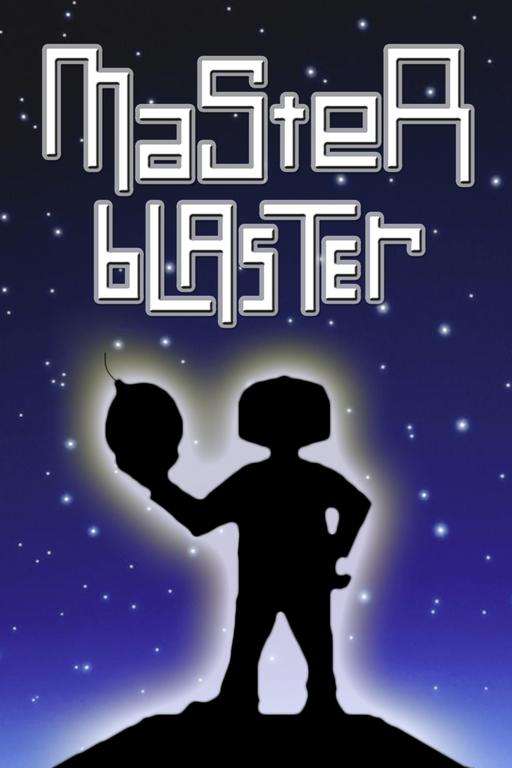

# masterblaster-löve
Remake of the Amiga game Master Blaster in LÖVE.



## Overview
masterblaster-löve is a modern remake of the classic Amiga game Master Blaster, developed using the [LÖVE](https://love2d.org/) framework. This project aims to capture the spirit and gameplay of the original while introducing improvements and modern programming practices.

## Features
- Faithful recreation of the classic Master Blaster gameplay.
- Enhanced graphics and sound optimized for modern displays.
- Modular and easily extendable codebase.
- Cross-platform support on Windows, macOS, and Linux.

## References
- [LÖVE framework](https://love2d.org/)
- [Master Blaster on OpenRetro](https://openretro.org/amiga/master-blaster)
- [Master Blaster on Lemon Amiga](https://www.lemonamiga.com/games/details.php?id=2960)

## Installation
### Prerequisites
- [LÖVE 11.3+](https://love2d.org/)
- Git (for cloning the repository)

### Steps
1. Clone the repository:
   ```bash
   git clone https://github.com/yourusername/masterblaster-love.git
   ```
2. Navigate to the project directory:
   ```bash
   cd masterblaster-love
   ```
3. Run the game using LÖVE:
   ```bash
   love .
   ```

## Gameplay
The gameplay remains true to the original Master Blaster. Players navigate through challenging levels, avoid obstacles, and complete objectives to advance. For detailed instructions on game mechanics, refer to the in-game help screen.

## Development
### Code Structure
- **main.lua**: Entry point for the game.
- **src/**: Contains game logic, modules, and utilities.
- **assets/**: Holds images, sounds, and other media files.
- **conf.lua**: LÖVE configuration file to set up game settings.

### Running in Development Mode
To run the game in development mode with live reloading (if supported by your environment), use the following command:
```bash
love .
```
For debugging, consider integrating Lua debugging tools such as [ZeroBrane Studio](https://studio.zerobrane.com/).

### Testing
Tests are written using [busted](https://olivinelabs.com/busted/) or other Lua testing frameworks. To run tests:
```bash
busted
```
*(Adjust testing instructions if you decide to use a different framework.)*

## Contributing
Contributions are welcome. If you wish to contribute:
1. Fork the repository.
2. Create a new branch for your feature or bug fix.
3. Ensure your code adheres to the project's style guidelines.
4. Submit a pull request detailing your changes.

Please include detailed commit messages and documentation for new features.

## License
This project is licensed under the MIT License. See the [LICENSE](LICENSE) file for details.

## Acknowledgments
- Thanks to the original developers of Master Blaster.
- Appreciation for the LÖVE community and the resources provided by the references listed above.
